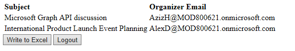
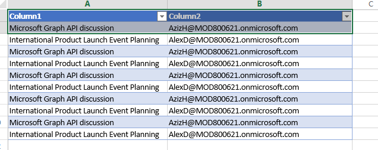

# Microsoft Graph REST Calendar Event and Excel Sample for Angular 4

## Table of contents

* [Introduction](#introduction)
* [Prerequisites](#prerequisites)
* [Register the application](#register-the-application)
* [Build and run the sample](#build-and-run-the-sample)
* [Code of note](#code-of-note)
* [Questions and comments](#questions-and-comments)
* [Contributing](#contributing)
* [Additional resources](#additional-resources)

## Introduction

This sample shows how to connect an Angular 4.0 app to a Microsoft work or school (Azure Active Directory) using the [Microsoft Graph API](https://developer.microsoft.com/en-us/graph/) to get a user's calendar events and upload information about them to an Excel file stored in OneDrive.

Once you authenticate and authorize the application, it gets one page of events from the user's calendar.

When you click the **Write to Excel** button, the application writes the contacts to an Excel file stored in the user's root OneDrive folder.

## Prerequisites

To use this sample, you need the following:
* [Node.js](https://nodejs.org/). Node is required to run the sample on a development server and to install dependencies. 
* [Angular CLI](https://github.com/angular/angular-cli)
* Either a [Microsoft account](https://www.outlook.com) or [Office 365 for business account](https://msdn.microsoft.com/en-us/office/office365/howto/setup-development-environment#bk_Office365Account)
* Upload the **demo.xlsx** file in the root of this repository to the root folder of your OneDrive account. This file contains an empty table with two columns.

## Register the application

1. Sign into the [App Registration Portal](https://apps.dev.microsoft.com/) using either your personal or work or school account.

2. Choose **Add an app**.

3. Enter a name for the app, and choose **Create application**. 
	
   The registration page displays, listing the properties of your app.

4. Copy the Application Id. This is the unique identifier for your app. 

5. Under **Platforms**, choose **Add Platform**.

6. Choose **Web**.

7. Make sure the **Allow Implicit Flow** check box is selected, and enter *http://localhost:8080/login* as the Redirect URI. 

8. Choose **Save**.

## Build and run the sample

1. Download or clone the Microsoft REST Calendar Event and Excel Sample for Angular 4.

2. Using your favorite IDE, open **configs.ts** in *src/app/shared*.

3. Replace the **ENTER_YOUR_CLIENT_ID** placeholder value with the application ID of your registered Azure application.

4. In a command prompt, run the following command in the root directory: `npm install`. This installs project dependencies, including the [HelloJS](http://adodson.com/hello.js/) client-side authentication library.

  
5. Run `npm start` to start the development server.

6. Navigate to [http://localhost:4200/](http://localhost:4200/) in your web browser.

7. Choose the **Sign in with your Microsoft account** button.

8. Sign in with your personal or work or school account and grant the requested permissions.

9. Click the **Write to Excel** button. Verify that the rows have been added to the **demo.xslx** file that you uploaded to your root OneDrive folder.

## Contributing

If you'd like to contribute to this sample, see [CONTRIBUTING.MD](/CONTRIBUTING.md).

This project has adopted the [Microsoft Open Source Code of Conduct](https://opensource.microsoft.com/codeofconduct/). For more information see the [Code of Conduct FAQ](https://opensource.microsoft.com/codeofconduct/faq/) or contact [opencode@microsoft.com](mailto:opencode@microsoft.com) with any additional questions or comments.

## Questions and comments

We'd love to get your feedback about this sample. You can send your questions and suggestions in the [Issues](https://https://github.com/jamescro/microsoft-graph-angular/issues) section of this repository.

Questions about Microsoft Graph development in general should be posted to [Stack Overflow](https://stackoverflow.com/questions/tagged/microsoftgraph). Make sure that your questions or comments are tagged with [microsoftgraph].
  
## Additional resources

- [Other Microsoft Graph Connect samples](https://github.com/MicrosoftGraph?utf8=%E2%9C%93&query=-Connect)
- [Microsoft Graph](https://developer.microsoft.com/en-us/graph/)

## Copyright
Copyright (c) 2017 Microsoft. All rights reserved.
